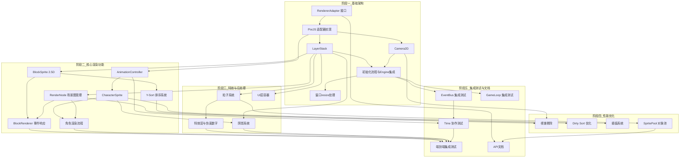

# 渲染系统开发任务清单

> **对应文档：** [`rendering_system_design.md`](rendering_system_design.md)
> **生成日期：** 2026-05-07
> **总任务数：** 26 项 | **P0 里程碑：** 7 项 | **预计开发阶段：** 5 个

---

## 开发阶段总览

| 阶段 | 名称 | 任务数 | P0 | P1 | P2 | 关键里程碑 |
|------|------|--------|----|----|----|-----------|
| 一 | 基础架构 | 6 | 5 | 1 | 0 | ✅ 渲染管线基础就绪 |
| 二 | 核心渲染功能 | 6 | 4 | 2 | 0 | ✅ 2.5D 方块世界可渲染 |
| 三 | 特效与后处理 | 4 | 0 | 3 | 1 | ✅ 视觉表现层完整 |
| 四 | 性能优化 | 4 | 0 | 3 | 1 | ✅ 性能达标 |
| 五 | 集成测试与文档 | 6 | 0 | 3 | 3 | ✅ 交付就绪 |

### 并行策略

- **阶段一 & 阶段二 可部分并行**：`T1`（RendererAdapter 接口）完成后，`T4`（Camera2D）可与`T3`（LayerStack）、`T7`（BlockSprite）并行开发。
- **阶段三 需阶段一完成**：必须在 LayerStack 就绪后启动。
- **阶段四 与阶段三 可部分并行**：`T18`（视锥剔除）与阶段三的特效开发可并行，`T21`（对象池）依赖阶段三的粒子系统。
- **阶段五 贯穿全程**：单元测试随任务同步编写，集成测试在各里程碑完成后集中开展。

---

## 阶段一：基础架构（Foundation Architecture）

> **目标：** 搭建渲染管线底层骨架，完成 RendererAdapter、LayerStack、Camera2D 三大基础设施，实现与 Engine 的集成。

---

### T1 — RendererAdapter 接口层

| 属性 | 内容 |
|------|------|
| **任务名称** | `RendererAdapter` 接口设计与抽象实现 |
| **简要描述** | 设计渲染适配器接口，定义 `init()`、`render()`、`resize()`、`destroy()` 等抽象方法，作为 PixiJS 上层调用的统一契约。核心引擎代码不直接 import PixiJS，通过此接口实现依赖倒置。 |
| **优先级** | P0 |
| **所属阶段** | 基础架构 |
| **前置依赖** | 无（独立接口定义） |
| **验收标准** | ① 接口包含 `init(canvas, options)`、`render(stage)`、`resize(w, h)`、`destroy()`、`getRenderer()` 方法定义；② 提供 TypeScript JSDoc 类型注释；③ 接口文件位于 `src/engine/render/RendererAdapter.js` |
| **可并行任务** | — |

---

### T2 — PixiJS 适配器实现

| 属性 | 内容 |
|------|------|
| **任务名称** | PixiJS 适配器 `PixiRendererAdapter` 实现 |
| **简要描述** | 基于 `RendererAdapter` 接口实现 PixiJS 具体适配器。封装 `PIXI.Application` 的创建，配置 `roundPixels: true`、`antialias: false`、`resolution: 3`（320×180 内部分辨率 → 960×540 输出），背景色 `#1a1a2e`，绑定到传入 canvas 元素。 |
| **优先级** | P0 |
| **所属阶段** | 基础架构 |
| **前置依赖** | T1（RendererAdapter 接口） |
| **验收标准** | ① PixiJS v8+ 作为 npm 依赖引入；② `init()` 成功创建 PIXI Application 并绑定 canvas；③ 验证 `roundPixels` 开启后无子像素偏移；④ 验证 `NEAREST` 采样模式下像素风格不模糊；⑤ 发射 `render:initialized` 事件 |
| **可并行任务** | — |

---

### T3 — LayerStack 图层管理栈

| 属性 | 内容 |
|------|------|
| **任务名称** | `LayerStack` 图层管理栈实现 |
| **简要描述** | 实现 8 层固定语义化图层容器：Sky/Background(0)、Ground(1)、Structures(2)、Decorations(3)、Characters(4)、Effects(5)、Shadows(6)、UI(7)。提供 `addToLayer(index, child)`、`removeFromLayer(index, child)`、`getLayer(index)`、`clear()` 等方法。层间排序固定，层内排序由 Y-sort 动态决定。 |
| **优先级** | P0 |
| **所属阶段** | 基础架构 |
| **前置依赖** | T2（PixiJS 适配器就绪后可用 PIXI.Container） |
| **验收标准** | ① 8 个 PIXI.Container 按顺序挂载到根 Container；② `addToLayer(4, sprite)` 正确添加到 Characters 层；③ `clear()` 清空所有层并触发 `render:layer-changed` 事件；④ 层间顺序正确（0 最下，7 最上） |
| **可并行任务** | T4 |

---

### T4 — Camera2D 相机系统

| 属性 | 内容 |
|------|------|
| **任务名称** | `Camera2D` 相机系统实现 |
| **简要描述** | 实现 2D 相机，包含 `position(x,y)`、`zoom`、`rotation` 属性。通过指数平滑（`smoothing = 0.1`）实现跟随效果：`pos += (target - pos) * smoothing`。相机变换作用于 Layer 0~6 的根 Container，UI 层（Layer 7）不受影响。支持边界钳位（clamp）。 |
| **优先级** | P0 |
| **所属阶段** | 基础架构 |
| **前置依赖** | T2（PixiJS 适配器就绪） |
| **验收标准** | ① `setTarget(target)` 后相机平滑跟随，停止时自然减速；② `setZoom(2.0)` 正确缩放视口；③ 相机变换只影响 Layer 0~6，Layer 7 UI 保持固定；④ 边界钳位生效，相机不超出地图范围；⑤ 发射 `render:camera-moved` 事件 |
| **可并行任务** | T3 |

---

### T5 — 渲染系统初始化流程与 Engine 集成

| 属性 | 内容 |
|------|------|
| **任务名称** | 渲染系统初始化流程与 `Engine` 集成 |
| **简要描述** | 实现渲染系统的初始化编排：`Engine.start()` → `RendererAdapter.init()` → 创建 `LayerStack` → 创建 `Camera2D` → 设置默认 viewport → 发射 `render:initialized`。渲染系统作为 `variable` 类型的 GameSystem 注册到 `GameLoop` 中。 |
| **优先级** | P0 |
| **所属阶段** | 基础架构 |
| **前置依赖** | T1（RendererAdapter 接口）、T2（PixiJS 适配器）、T3（LayerStack）、T4（Camera2D） |
| **验收标准** | ① `Engine.start()` 完整走通初始化流程；② 渲染系统作为 `variable` System 成功注册到 GameLoop；③ 初始化后 `render:initialized` 事件被发射；④ 浏览器可见 canvas 且背景色正确 |
| **可并行任务** | —（该任务是阶段一的集成点，需前置任务均完成） |

---

### T6 — 窗口大小变化响应处理

| 属性 | 内容 |
|------|------|
| **任务名称** | 窗口 `resize` 事件处理 |
| **简要描述** | 监听 `window.resize`（Electron 环境通过 `BrowserWindow` resize 事件转发），重新计算 PixiJS renderer 尺寸，同步更新 Camera2D 的 `viewWidth/viewHeight`。保证窗口缩放时画面比例不变形。 |
| **优先级** | P1 |
| **所属阶段** | 基础架构 |
| **前置依赖** | T5（渲染系统初始化就绪） |
| **验收标准** | ① resize 后 renderer 尺寸正确更新；② Camera2D 的视口宽高同步更新；③ 画面内容不拉伸变形；④ 连续快速 resize 无性能问题（可加防抖） |
| **可并行任务** | T7、T8、T9 |

---

## 阶段二：核心渲染功能（Core Rendering Features）

> **目标：** 实现场景中所有核心渲染对象——BlockSprite（2.5D 方块）、CharacterSprite（角色）、AnimationController（动画），以及 Y-Sort 排序系统。

---

### T7 — BlockSprite 2.5D 方块渲染

| 属性 | 内容 |
|------|------|
| **任务名称** | `BlockSprite` 2.5D 斜角方块渲染实现 |
| **简要描述** | 实现 `BlockSprite` 类，内部包含三个子 Sprite（顶面、左面、右面），对应 45° 斜视角三面渲染。提供 `setGridPosition(gx, gy, gz)` 方法，将网格坐标变换为屏幕坐标。支持不同方块类型（草、土、石、木等）的贴图映射。 |
| **优先级** | P0 |
| **所属阶段** | 核心渲染功能 |
| **前置依赖** | T3（LayerStack 提供 Container 挂载点） |
| **验收标准** | ① 三个面（顶/左/右）正确拼接显示，无缝隙；② `setGridPosition(0,0,0)` 正确映射到屏幕坐标；③ 不同方块类型显示对应贴图；④ `setGridPosition` 更新后 zIndex 同步更新（为 Y-sort 准备） |
| **可并行任务** | T8、T9 |

---

### T8 — CharacterSprite 角色容器

| 属性 | 内容 |
|------|------|
| **任务名称** | `CharacterSprite` 角色容器实现 |
| **简要描述** | 实现角色组合体容器：`PIXI.Sprite`（身体）+ `AnimationController`（动画控制）+ `PIXI.Sprite`（阴影）+ `PIXI.Container`（血条/状态图标）。提供 `useInterpolation` 开关（默认开启，战斗时自动关闭），以及 `setGridPosition(gx, gy, gz)` 方法。 |
| **优先级** | P0 |
| **所属阶段** | 核心渲染功能 |
| **前置依赖** | T3（LayerStack 提供挂载点）、T9（AnimationController 就绪后角色动画可用） |
| **验收标准** | ① 角色容器包含身体、阴影、血条三层组合；② `setGridPosition` 正确移动整个容器；③ `useInterpolation` 开关开启/关闭时插值行为正确；④ 阴影位置与角色位置同步联动 |
| **可并行任务** | T7 |

---

### T9 — AnimationController 精灵表动画控制器

| 属性 | 内容 |
|------|------|
| **任务名称** | `AnimationController` 精灵表动画控制器实现 |
| **简要描述** | 实现低帧率（8~12 FPS）精灵表驱动动画控制器。内部维护帧计时器，每帧按 `frameDuration` 推进帧索引，切换 sprite 的 texture。动画更新放在 `variableUpdate` 中而非 `fixedUpdate`。支持暂停/恢复、帧序列配置、循环/单次模式。 |
| **优先级** | P0 |
| **所属阶段** | 核心渲染功能 |
| **前置依赖** | T2（PixiJS Texture 管理就绪） |
| **验收标准** | ① 精灵表能被正确切分并按序列播放；② 动画帧率稳定在配置的 FPS（如 10 FPS）；③ `pause()` 暂停动画，`resume()` 恢复；④ 支持循环（loop）和单次播放模式；⑤ `engine:pause` 事件触发时动画暂停，`engine:resume` 恢复 |
| **可并行任务** | T7 |

---

### T10 — Y-Sort 排序系统

| 属性 | 内容 |
|------|------|
| **任务名称** | Y-Sort 层内深度排序系统实现 |
| **简要描述** | 实现层内 Y-sort 排序机制。排序键公式：`sortKey = (gx + gy) * Z_BASE + gz`（`Z_BASE = 100`）。利用 PixiJS 的 `sortableChildren` 属性 + `zIndex` 实现自动排序。维护 `_dirtySort` 标志，仅在对象新增/移动/移除时触发排序。静态层（Layer 1 地面）仅排序一次。 |
| **优先级** | P0 |
| **所属阶段** | 核心渲染功能 |
| **前置依赖** | T3（LayerStack 提供排序容器环境）、T7（BlockSprite 提供排序对象） |
| **验收标准** | ① 排序键公式正确：`(gx+gy)*100 + gz`；② 同一层内对象按屏幕 Y 值正确排序（Y 值大的覆盖 Y 值小的）；③ 静态层仅排序一次，动态层按需排序；④ 性能：500 个对象排序耗时 < 1ms |
| **可并行任务** | — |

---

### T11 — RenderNode 数据结构与场景图管理

| 属性 | 内容 |
|------|------|
| **任务名称** | `RenderNode` 数据结构与场景图增删管理 |
| **简要描述** | 实现 `RenderNode` 数据结构（id, layerIndex, container, visible, sortKey, onRemove），提供场景图中渲染对象的增删改管理：`addToLayer`、`removeFromLayer`、移动（仅更新 x/y）。移除时自动调用 `container.destroy()` 释放 GPU 纹理引用。 |
| **优先级** | P0 |
| **所属阶段** | 核心渲染功能 |
| **前置依赖** | T3（LayerStack 就绪） |
| **验收标准** | ① RenderNode 结构完整，可追踪所有活跃渲染对象；② 新增渲染对象触发 `render:layer-changed` 事件；③ 移除对象时正确调用 destroy 释放资源；④ 移动操作不涉及场景图结构变更，性能轻量 |
| **可并行任务** | T7、T8、T9 |

---

### T12 — 方块增删事件响应与 BlockRenderer

| 属性 | 内容 |
|------|------|
| **任务名称** | `BlockRenderer` 方块渲染器与事件响应 |
| **简要描述** | 实现 `BlockRenderer.buildVisualsFromGrid()`，遍历网格数据为每个方块生成 BlockSprite。根据 gz 值决定放入 Layer 1（gz=0）还是 Layer 2（gz≥1）。订阅 `block:placed` 事件新增 BlockSprite，订阅 `block:removed` 事件移除 BlockSprite。 |
| **优先级** | P1 |
| **所属阶段** | 核心渲染功能 |
| **前置依赖** | T7（BlockSprite 实现）、T11（RenderNode 场景图管理） |
| **验收标准** | ① `buildVisualsFromGrid(gridData)` 正确遍历所有方块生成 BlockSprite；② gz=0 的方块放入 Layer 1，gz≥1 的放入 Layer 2；③ `block:placed` 事件触发后新增对应 BlockSprite；④ `block:removed` 事件触发后正确移除且释放资源 |
| **可并行任务** | T13 |

---

### T13 — 角色生成与移除流程

| 属性 | 内容 |
|------|------|
| **任务名称** | 角色渲染控制器——生成/移除/移动 |
| **简要描述** | 实现角色渲染控制器，处理角色 spawn 时创建 `CharacterSprite` 并放入 Layer 4。订阅 `player:moved` 事件更新 CharacterSprite 位置，触发阴影同步。角色死亡/移除时从场景图中剥离并销毁。 |
| **优先级** | P1 |
| **所属阶段** | 核心渲染功能 |
| **前置依赖** | T8（CharacterSprite 实现）、T11（RenderNode 场景图管理） |
| **验收标准** | ① 角色 spawn 时 CharacterSprite 正确添加到 Layer 4；② `player:moved` 事件触发后位置同步更新；③ 角色移除时 CharacterSprite 正确销毁，纹理引用释放；④ 阴影随角色同步移动 |
| **可并行任务** | T12 |

---

## 阶段三：特效与后处理（Effects & Post-Processing）

> **目标：** 实现粒子系统、特效层、阴影系统和 UI 层，完成视觉表现层的完整构建。

---

### T14 — 粒子系统实现（ParticleContainer）

| 属性 | 内容 |
|------|------|
| **任务名称** | 粒子系统 `ParticleContainer` 实现 |
| **简要描述** | 实现粒子系统，用于符箓光芒、飞剑轨迹、法术特效等。粒子系统使用独立计时器，不通过 `Time` 系统驱动——即使游戏暂停，粒子效果继续播放直到消散。支持粒子生命周期（生成→运动→淡出→消亡）、颜色变化、缩放、旋转。 |
| **优先级** | P1 |
| **所属阶段** | 特效与后处理 |
| **前置依赖** | T3（LayerStack 提供 Effects 层挂载点） |
| **验收标准** | ① 粒子按生命周期正确播放：生成→运动→淡出→消亡；② 游戏暂停（`engine:pause`）时粒子不冻结，继续播放；③ `engine:destroy` 时所有粒子强制清除；④ 支持同时存在 500+ 粒子而帧率不显著下降 |
| **可并行任务** | T16（阴影可独立开发） |

---

### T15 — 特效层与伤害数字

| 属性 | 内容 |
|------|------|
| **任务名称** | 特效层管理——伤害数字与符箓特效 |
| **简要描述** | 实现 Effect 层（Layer 5）的特效管理。订阅 `combat:damage-dealt` 事件，在 Effects 层生成伤害数字 Sprite，自动淡出并移除。支持符箓特效等一次性视觉效果的触发与生命周期管理。使用叠加混合模式（blendMode）实现半透明发光效果。 |
| **优先级** | P1 |
| **所属阶段** | 特效与后处理 |
| **前置依赖** | T3（LayerStack 就绪）、T14（粒子系统就绪） |
| **验收标准** | ① 伤害数字正确生成并自动淡出移除；② 符箓特效触发后粒子效果正确播放；③ 混合模式效果正确（发光半透明质感）；④ 特效结束后资源正确释放 |
| **可并行任务** | T16 |

---

### T16 — 阴影系统实现

| 属性 | 内容 |
|------|------|
| **任务名称** | 阴影系统 `ShadowSprite` 实现 |
| **简要描述** | 实现阴影精灵，放置于 Layer 6（Shadows）。每个 `ShadowSprite` 监听其父对象（方块/角色）的移动事件，同步更新自身位置和 zIndex，确保阴影覆盖关系正确。阴影具有半透明效果，增强 2.5D 视觉深度感。 |
| **优先级** | P1 |
| **所属阶段** | 特效与后处理 |
| **前置依赖** | T3（LayerStack 就绪）、T8（CharacterSprite 需要阴影能力） |
| **验收标准** | ① 阴影精灵随父对象移动同步更新位置；② 阴影的 zIndex 与父对象一致，排序正确；③ 阴影为半透明显示；④ 父对象移除时阴影自动销毁 |
| **可并行任务** | T14、T15 |

---

### T17 — UI 层容器与 HUD 集成

| 属性 | 内容 |
|------|------|
| **任务名称** | UI 层容器与 HUD 基础集成 |
| **简要描述** | 实现 Layer 7（UI）容器，不随相机移动。提供 HUD 基础布局容器挂载点（HPBar、MPBar、TalismanSlot 等）。UI 层固定在屏幕坐标系下，不受相机缩放/平移影响。 |
| **优先级** | P2 |
| **所属阶段** | 特效与后处理 |
| **前置依赖** | T3（LayerStack 就绪） |
| **验收标准** | ① UI 层 Container 正确挂载在 Layer 7；② 相机移动/缩放时 UI 保持固定位置；③ HUD 元素可正常添加到 UI 层并正确显示；④ UI 层在最顶层渲染 |
| **可并行任务** | T14、T15、T16 |

---

## 阶段四：性能优化（Performance Optimization）

> **目标：** 在完整渲染管线基础上进行性能调优，确保在目标硬件上流畅运行（320×180 内部分辨率下稳定 60 FPS）。

---

### T18 — 视锥剔除实现

| 属性 | 内容 |
|------|------|
| **任务名称** | 视锥剔除（View Frustum Culling）实现 |
| **简要描述** | 在 `LayerStack.render()` 的遍历阶段，对 Layer 0~6 内每个子对象执行视锥剔除：检查对象是否在当前屏幕可见范围内。不可见对象设置 `visible = false` 跳过渲染。大幅减少远离相机的对象的渲染开销。 |
| **优先级** | P1 |
| **所属阶段** | 性能优化 |
| **前置依赖** | T4（Camera2D 提供视口信息）、T11（RenderNode 提供对象位置） |
| **验收标准** | ① 视口外的对象被正确剔除（`visible = false`）；② 相机移动时，刚进入视口的对象正确变为可见；③ 性能提升：大面积地图场景下方块剔除后 draw call 减少 50%+；④ 剔除计算的额外开销 < 0.5ms |
| **可并行任务** | T19、T20 |

---

### T19 — Dirty Sort 标记与降频排序优化

| 属性 | 内容 |
|------|------|
| **任务名称** | 脏标记排序优化（Dirty Sort + 降频） |
| **简要描述** | 优化 Y-sort 排序性能：维护 `_dirtySort` 标志，仅在新增/移动/移除对象时设为 true，无变化时跳过排序。实现基于时间戳的降频策略：静态层（Layer 1、2）仅在场景加载时排序一次，动态层（Layer 4、5）控制排序频率上限（如每 3 帧最多排序一次）。 |
| **优先级** | P1 |
| **所属阶段** | 性能优化 |
| **前置依赖** | T10（Y-Sort 排序系统就绪） |
| **验收标准** | ① 场景加载完成后静态层不再触发排序；② 动态层排序频率可配置，降频后视觉无异常；③ 500 个子节点层，全量排序 + 脏检查综合开销 < 0.5ms；④ 对象移动后正确触发单次排序 |
| **可并行任务** | T18、T20 |

---

### T20 — 插值系统与 useInterpolation 开关

| 属性 | 内容 |
|------|------|
| **任务名称** | 物理帧插值系统与战斗自动关闭机制 |
| **简要描述** | 实现 `interp` 插值因子在渲染系统中的应用。`CharacterSprite` 位置计算：`prevPos + (currentPos - prevPos) * interp`。提供 `useInterpolation` 开关，默认开启；战斗时自动关闭（像素风格一格一跳的视觉反馈）。 |
| **优先级** | P1 |
| **所属阶段** | 性能优化 |
| **前置依赖** | T8（CharacterSprite 就绪） |
| **验收标准** | ① `interp` 开启时角色移动顺滑，无物理步长跳跃感；② 关闭时角色以像素网格为单位一格一跳；③ 进入战斗状态自动关闭插值；④ 战斗结束自动恢复插值 |
| **可并行任务** | T18、T19 |

---

### T21 — SpritePool 对象池实现

| 属性 | 内容 |
|------|------|
| **任务名称** | `SpritePool` 对象池实现 |
| **简要描述** | 实现精灵对象池，用于弹幕/特效/临时视觉元素的复用。减少频繁创建/销毁 PIXI.Sprite 带来的 GC 压力。池化对象包括：伤害数字 Sprite、粒子精灵、弹幕投影等。支持预热（预创建 N 个实例）和自动扩容。 |
| **优先级** | P2 |
| **所属阶段** | 性能优化 |
| **前置依赖** | T14（粒子系统就绪，获取使用对象池的场景） |
| **验收标准** | ① 对象池正确复用精灵，减少 GC 次数；② `acquire()` 返回可用实例，`release()` 正确回收；③ 预热后首次使用无延迟；④ 大量弹幕场景（100+ 对象/s）FPS 稳定 60 |
| **可并行任务** | T18、T19、T20 |

---

## 阶段五：集成测试与文档（Integration Testing & Documentation）

> **目标：** 通过系统级集成测试验证渲染系统与核心引擎的协作正确性，编写开发文档。

---

### T22 — 渲染系统与 EventBus 事件协作测试

| 属性 | 内容 |
|------|------|
| **任务名称** | 渲染系统 ↔ EventBus 事件集成测试 |
| **简要描述** | 编写集成测试，验证渲染系统正确订阅/发射的关键事件。覆盖：`scene:activated` → 清空 LayerStack；`block:placed` → 新增 BlockSprite；`block:removed` → 移除 BlockSprite；`engine:pause/resume` → 动画暂停/恢复。验证渲染系统不直接引用游戏逻辑模块。 |
| **优先级** | P1 |
| **所属阶段** | 集成测试与文档 |
| **前置依赖** | T5（渲染系统初始化就绪）、T11（RenderNode 场景图管理） |
| **验收标准** | ① 所有事件订阅/发射用例通过 Jest 或 Vitest 测试；② 验证渲染系统不直接 import 游戏逻辑模块；③ 事件响应符合设计文档的时序要求 |
| **可并行任务** | T23、T24 |

---

### T23 — 渲染系统与 GameLoop 集成测试

| 属性 | 内容 |
|------|------|
| **任务名称** | 渲染系统 ↔ GameLoop 周期集成测试 |
| **简要描述** | 编写集成测试，验证渲染系统作为 `variable` 类型 System 在 GameLoop 中的集成正确性。验证 `variableUpdate` 阶段的三个子阶段调用顺序：`CameraSystem.update()` → `LayerStack.render()` → `RendererAdapter.render()`。确认 `fixedUpdate` 阶段渲染系统不做任何事。 |
| **优先级** | P1 |
| **所属阶段** | 集成测试与文档 |
| **前置依赖** | T5（渲染系统初始化就绪） |
| **验收标准** | ① 渲染系统作为 variable System 正确注册；② variableUpdate 中三个子阶段按文档顺序执行；③ fixedUpdate 中渲染系统无操作（调试验证不执行逻辑）；④ `engine:tick-end` 事件在渲染完成后发射 |
| **可并行任务** | T22、T24 |

---

### T24 — 渲染系统与 Time 系统协作测试

| 属性 | 内容 |
|------|------|
| **任务名称** | 渲染系统 ↔ Time 系统协作测试 |
| **简要描述** | 编写测试验证渲染系统正确使用 `Time` 类的 `deltaTime` 和 `interp`。验证：`timeScale = 1.0` 时动画正常速度；`timeScale = 0.5` 时动画半速（子弹时间效果）；`timeScale = 0` 时动画暂停。验证粒子的独立计时器不受 `timeScale` 影响。 |
| **优先级** | P1 |
| **所属阶段** | 集成测试与文档 |
| **前置依赖** | T9（AnimationController 就绪）、T22（EventBus 事件测试就绪） |
| **验收标准** | ① `deltaTime` 正确驱动 AnimationController 帧推进；② `timeScale = 0.5` 时动画速度减半；③ `timeScale = 0` 时动画冻结，但粒子继续播放；④ `interp` 传递到 CharacterSprite 的位置计算中 |
| **可并行任务** | T22、T23 |

---

### T25 — 端到端渲染集成测试

| 属性 | 内容 |
|------|------|
| **任务名称** | 端到端渲染管线集成测试 |
| **简要描述** | 编写端到端测试，模拟完整游戏场景：加载地图网格数据 → `BlockRenderer.buildVisualsFromGrid()` → 角色生成 → 相机跟随 → 方块放置/移除 → 伤害数字触发 → 粒子特效播放 → 窗口 resize → 场景切换（清空 LayerStack 重新加载）。验证全流程正确性。 |
| **优先级** | P2 |
| **所属阶段** | 集成测试与文档 |
| **前置依赖** | T12（BlockRenderer）、T13（角色渲染）、T15（特效）、T16（阴影）、T24（Time 协作）——所有功能模块就绪 |
| **验收标准** | ① 模拟场景加载后所有渲染对象正确显示；② 方块增删操作后场景正确更新；③ 相机跟随移动平稳；④ 伤害数字/特效触发后正确显示并自动移除；⑤ 场景切换后旧对象全部释放、新对象正确加载 |
| **可并行任务** | —（该任务是阶段五的集成点） |

---

### T26 — API 文档与开发者指南

| 属性 | 内容 |
|------|------|
| **任务名称** | 渲染系统 API 文档与开发者指南编写 |
| **简要描述** | 编写渲染系统 API 参考文档和开发者使用指南。覆盖：`RendererAdapter` 接口说明、`LayerStack` 使用示例、`BlockSprite` 配置与方块类型扩展、`CharacterSprite` 自定义、`AnimationController` 精灵表配置格式、`Camera2D` 配置、自定义特效注册方式。包含典型用例代码片段。 |
| **优先级** | P2 |
| **所属阶段** | 集成测试与文档 |
| **前置依赖** | 所有功能模块开发完成（T1~T21） |
| **验收标准** | ① API 文档覆盖所有公开类和方法的 JSDoc 注释；② 开发者指南包含至少 5 个典型使用示例；③ 文档包含图层索引速查表和事件列表；④ 文档路径为 `docs/api/rendering-system-api.md` |
| **可并行任务** | —（最后完成） |

---

## 关键里程碑节点

| 里程碑 | 关联任务 | 预期标志 |
|--------|---------|---------|
| **M1：渲染管线基础就绪** | T1~T6 | Canvas 可见、背景色正确、Engine 启动无报错 |
| **M2：2.5D 方块世界可渲染** | T7~T13 | 地图网格数据可渲染为 2.5D 方块场景，角色可显示 |
| **M3：视觉表现层完整** | T14~T17 | 粒子特效、伤害数字、阴影、UI 均可见且交互正确 |
| **M4：性能达标** | T18~T21 | 大面积地图下稳定 60 FPS，对象池复用生效 |
| **M5：交付就绪** | T22~T26 | 全量集成测试通过，API 文档完备 |

---

## 依赖关系图（Mermaid）

---

## 开发排期建议

| 迭代 | 周期 | 重点任务 | 目标里程碑 |
|------|------|---------|-----------|
| Sprint 1 | 第 1-2 周 | T1, T2, T3, T4 | 基础架构搭建 |
| Sprint 2 | 第 3-4 周 | T5, T6, T7, T9 | 渲染管线运行 + 核心对象 |
| Sprint 3 | 第 5-6 周 | T8, T10, T11, T12, T13 | 2.5D 方块世界可渲染（M2） |
| Sprint 4 | 第 7-8 周 | T14, T15, T16, T17 | 视觉表现层完整（M3） |
| Sprint 5 | 第 9-10 周 | T18, T19, T20, T21 | 性能达标（M4） |
| Sprint 6 | 第 11-12 周 | T22, T23, T24, T25, T26 | 交付就绪（M5） |

---

> **文档版本：** v1.0
> **最后更新：** 2026-05-07
> **生成依据：** [`rendering_system_design.md`](rendering_system_design.md)
